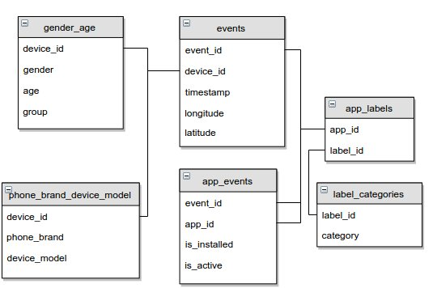

 - gender_age_train.csv, gender_age_test.csv - the training and test set
    - group: this is the target variable you are going to predict
 - events.csv, app_events.csv - when a user uses TalkingData SDK, the event gets logged in this data. Each event has an event id, location (lat/long), and the event corresponds to a list of apps in app_events.
    - timestamp: when the user is using an app with TalkingData SDK
 - app_labels.csv - apps and their labels, the label_id's can be used to join with label_categories
 - label_categories.csv - apps' labels and their categories in text
 - phone_brand_device_model.csv - device ids, brand, and models
    - phone_brand: note that the brands are in Chinese (translation courtesy of user fromandto) 

### 手机brand数据

### 手机appevent数据

注意 这里event和app_event只有一部分有数据，其中train大概有23309， 最终的test数据
中可以有60822-23309个device是可以通过event来修正的

根据经纬度拿到当地时区，然后计算时间点